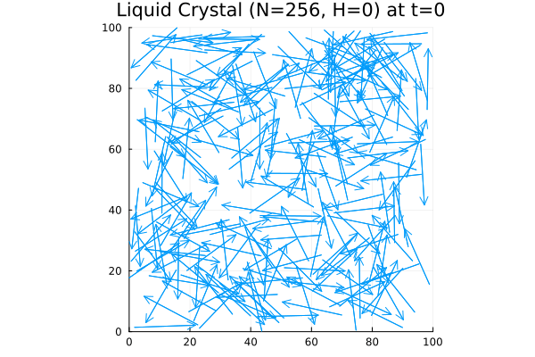

# 2D Liquid Crystal Simulation

This repository contains a Monte Carlo simulation of a 2D nematic liquid crystal system using the Metropolis algorithm. Molecules are modeled as rigid rods in 2D space, each with a position and an orientation. The simulation visualizes the evolution of the system optionally under optionally an external field.

<p align="center">
  
</p>

---

## Features
- **2D liquid crystal simulation** using Metropolis Monte Carlo
- **Rods with continuous orientation angles**
- Interaction based on spatial and angular overlap
- Visualization via animated GIF and order parameter plot

---

## Repository Contents

| File                          | Description                                  |
|-------------------------------|----------------------------------------------|
| `nematic_monte_carlo.jl`      | Main simulation script                       |
| `images/`                     | Animations and plots of the order parameter  |
| `data/`                       | Raw simulation data (positions and angles)   |

---

## Try it in Google Colab

[](
https://colab.research.google.com/github/Hiromu-USHIHARA/2dLiquidCrystal/blob/main/demo.ipynb)

---

## Model and Simulation Strategy

This simulation models **2D nematic liquid crystals** as rigid rods characterized by a position $(x, y)$ and an orientation angle $\theta$, confined to a square domain. The molecules are not allowed to overlap, and the interaction is determined based on angular difference and spatial proximity.

- The system evolves via the **Metropolis Monte Carlo algorithm**.
- At each step, one molecule is randomly selected and a small displacement in position and orientation is proposed.
- The proposal is accepted with the Metropolis probability based on the **energy difference** and **Boltzmann factor**:

$$
P_{\text{accept}} = 
\begin{cases}
1, & \Delta E \leq 0, \\
\exp(-\Delta E / k_B T), & \Delta E > 0.
\end{cases}
$$

- The interaction energy is computed from:
  - **Excluded volume effect** — overlapping rods increase the energy
  - **External field** — modeled as a sinusoidal potential favoring alignment in a specific direction

This process is repeated for many Monte Carlo sweeps to simulate the temporal evolution of the system.

---

## Order Parameter

To quantify the degree of orientational ordering in the system, we calculate the **nematic order parameter** $S$. Unlike polar order, nematic order does not distinguish between a molecule pointing in direction $\theta$ and one pointing in direction $\theta + \pi$. Therefore, the order parameter is defined using $2\theta$:

$$
S = \sqrt{\langle \cos(2\theta) \rangle^2 + \langle \sin(2\theta) \rangle^2},
$$

where $\langle \cdot \rangle$ denotes the average over all molecules.

- $S \approx 1$: high degree of alignment (ordered phase)
- $S \approx 0$: random orientations (disordered phase)

Tracking $S(t)$ over time reveals how thermal fluctuations and external fields affect molecular alignment.

---

## Adjustable Parameters
In `nematic_monte_carlo.jl`, modify the constants below to change simulation behavior:

```julia
const num_particles = 2^8        # Number of rod-like molecules
const num_steps = 2^7            # Simulation steps
const system_size = 100.0        # Size of the square domain
const molecule_length = 20.0     # Length of each molecule
```

---

